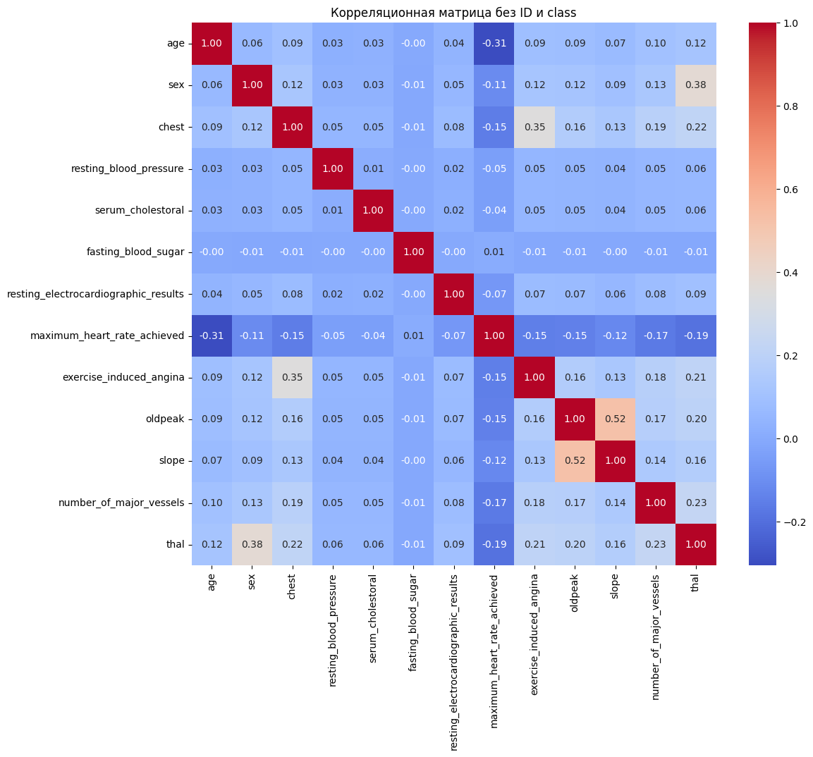
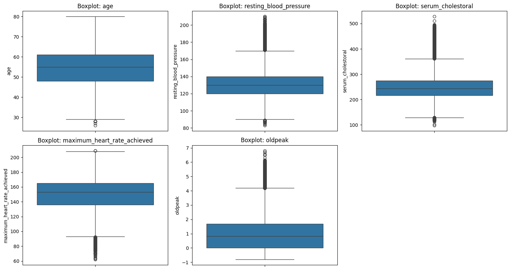
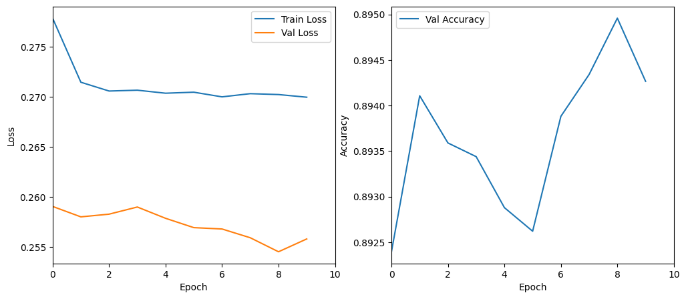

# heart_disease_prediction
## Описание
В этом проекте разработана модель предсказания сердечно-сосудистых заболеваний на основе медицинских данных. Используются методы машинного обучения и глубокого обучения, включая логистическую регрессию, случайный лес и нейронную сеть.

Данные проходят предобработку, анализ, и на их основе обучаются модели, которые способны предсказывать вероятность наличия сердечного заболевания у пациента.

---

## Используемые модели

- Logistic Regression
- Random Forest
- Neural Network (PyTorch)

---

## Основные шаги по выполнению проекта 

- Импорт необходимых библиотек и загрузка данных
- Ознакомление с данными и первичный анализ
- Предварительная обработка и очистка данных
- Преобразование категориальных переменных в фиктивные переменные
- Анализ данных
- Обучение и сравнение результатов моделей

---

## Анализ данных

- Построена корреляционная матрица (heatmap)
- Выявлены выбросы с помощью boxplot
- Проанализированы наиболее важные признаки (`thal`, `chest pain`, `oldpeak`)

### Heatmap корреляции

### Boxplot по ключевым признакам

---

## Предобработка данных

- Округление категориальных признаков (`Chest_bin`)
- Кодирование категориальных признаков (`Sex`, `Fasting_blood_sugar`, `Thal`, и др.)
- Масштабирование данных
- Разделение на обучающую и валидационную выборки (train/val/test split)

---

## Графики обучения

### Нейронная сеть
- Accuracy и Loss по эпохам

---

## Результаты моделей

| Модель              | Accuracy |
|---------------------|----------|
| Logistic Regression | 88.78%   |
| Random Forest       | 89.59%   |
| Neural Network      | 89.43%   |

---

## Инференс

Модель обучена на тренировочных данных, предсказания (`submission.csv`) сгенерированы и готовы для отправки.

---

## Статья

Для теоретического обоснования была изучена статья:  
**"An artificial intelligence model for heart disease detection using machine learning algorithms"**  
Авторы: Victor Chang, Vallabhaneni Rupa Bhavani, Ariel Qianwen Xu, MA Hossain

Авторы используют методы машинного обучения (Random Forest, SVM, Logistic Regression и другие) на медицинских данных для диагностики сердечных заболеваний. Они подчеркивают важность предобработки, выбора признаков и балансировки классов. Результаты показывают высокую точность, особенно у ансамблевых методов.

---

##  Используемые библиотеки

- Python 3.10+
- Scikit-learn
- Pandas, NumPy
- Seaborn, Matplotlib
- PyTorch
- Google Colab (для обучения)

---

## Заключение

В рамках проекта была успешно реализована система предсказания сердечно-сосудистых заболеваний с использованием различных алгоритмов машинного обучения. Проведен анализ данных, очистка и обработка признаков, визуализация корреляций и выбросов. Были обучены и сравнены три модели: логистическая регрессия, случайный лес и нейронная сеть на PyTorch.

Сравнение показало, что нейронная сеть и случайный лес демонстрируют наилучшие показатели точности, что подтверждает эффективность использования современных методов ИИ в области здравоохранения. Полученные результаты могут быть использованы в реальных медицинских задачах для предварительной диагностики и повышения качества обслуживания пациентов.

---

## Ссылка на датасеты

- [Датасеты (train/test) доступны по ссылке](https://www.kaggle.com/competitions/tech-weekend-data-science-hackathon/data)

